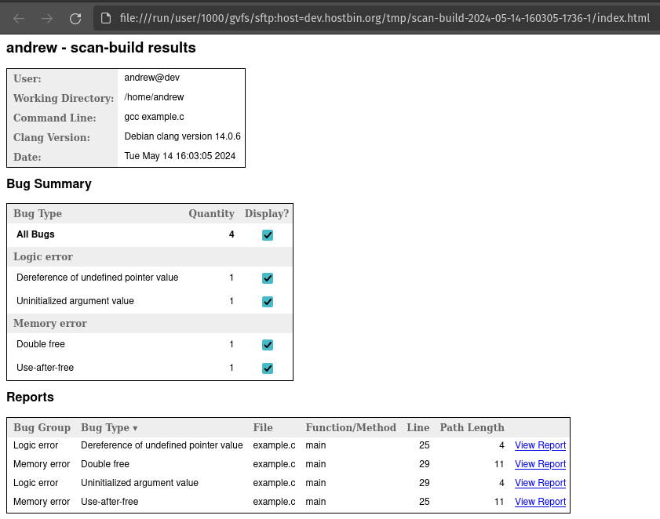
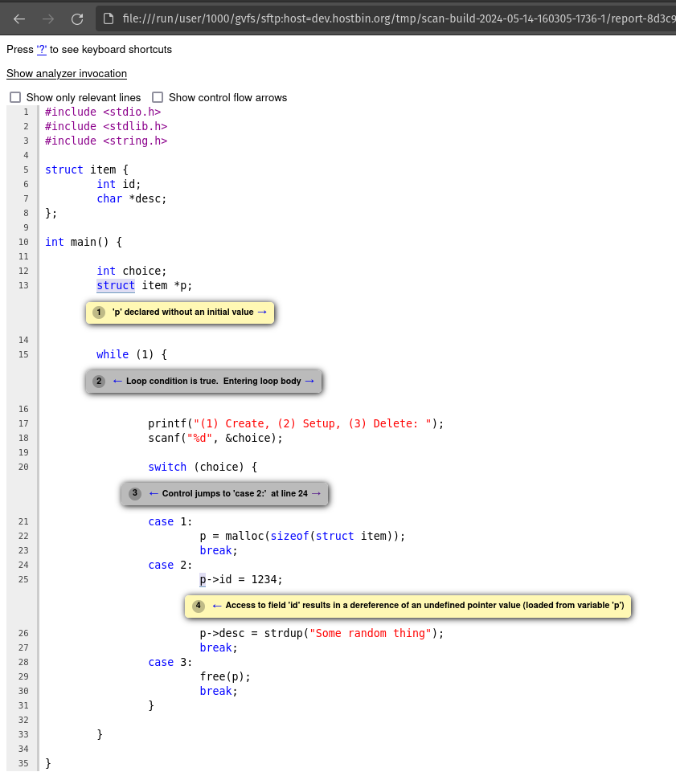
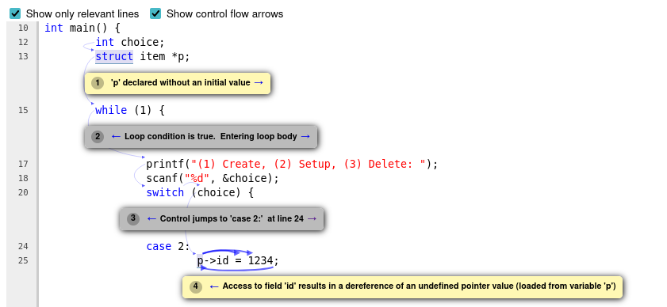

# How to use scan-build

Scan-build is a static analyzer which examines a program _as it's being compiled_ to identify bugs.  Because scan-build has access to all the program structure information generated by the compiler, it can detect even very subtle bugs which require complex conditions in order to trigger.  If you are struggling to track down a tricky bug which other tools can't identify, scan-build may be able to help.

Scan-build can be invoked by simply adding `scan-build` at the beginning of the command when you compile your code.  For instance...

```
scan-build gcc yourcode.c
```

When run like this, scan-build will generate a set of HTML (web page) files describing each bug in great detail.  By default these are stored in a temporary directory like `/tmp/scan-build-2024-05-14-153955-1542-1`.

If you are running scan-build _locally_ (such as in a VM on your own computer), then you can simply run `scan-view /tmp/scan-build-.....` to view them.  This will open a web browser where you can review the results.

These files are not easily viewable on the command line though, so if you are running scan-build through SSH on a remote machine (such as the `cs.dsunix.net` or `dev.hostbin.org` servers), you will need to download the results first in order to view them locally.  A tool like SCP (secure copy) would be ideal for this.  If you are using Windows then [WinSCP](https://winscp.net/eng/download.php) can be used to download the result files.  You may then open the `index.html` file in that directory locally in order to view the results.

## Example

Consider the following program which is meant to create, setup, and delete "items".  As we can see the program runs in a loop, each time asking the user what action to take (by inputting a number 1-3), and then taking that action.

 - When the user enters `1`, the program will allocate a new `struct item` structure.
 - When the user enters `2`, the program will set the `id` and `desc` members of that structure.
 - When the user enters `3`, the program will free the structure, thus deleting it.

```c
#include <stdio.h>
#include <stdlib.h>
#include <string.h>

struct item {
	int id;
	char *desc;
};

int main() {

	int choice;
	struct item *p;

	while (1) {

		printf("(1) Create, (2) Setup, (3) Delete: ");
		scanf("%d", &choice);

		switch (choice) {
		case 1:
			p = malloc(sizeof(struct item));
			break;
		case 2:
			p->id = 1234;
			p->desc = strdup("Some random thing");
			break;
		case 3:
			free(p);
			break;
		}

	}

}
```

At first glance this program looks reasonable, but notice that several bugs exist which we can trigger by invoking the actions in an unexpected order.  For instance, if we attempt to delete the object twice in a row the program crashes with a cryptic "double free" error message.

```
andrew@dev:~$ gcc example.c
andrew@dev:~$ ./a.out 
(1) Create, (2) Setup, (3) Delete: 1
(1) Create, (2) Setup, (3) Delete: 3
(1) Create, (2) Setup, (3) Delete: 3
free(): double free detected in tcache 2
Aborted
```

Although in this case it is clear what went wrong, for more complex software (such as those using linked-lists) these bugs can be maddening to identify.  Let's see if scan-build can help us determine all the potential ways that this code may fail!

First, we compile the code with scan-build observing the process.

```
andrew@dev:~$ scan-build gcc example.c
scan-build: Using '/usr/lib/llvm-14/bin/clang' for static analysis
example.c:25:10: warning: Access to field 'id' results in a dereference of an undefined pointer value (loaded from variable 'p') [core.NullDereference]
                        p->id = 1234;
                        ~     ^
example.c:25:10: warning: Use of memory after it is freed [unix.Malloc]
                        p->id = 1234;
                        ~~~~~ ^
example.c:29:4: warning: Attempt to free released memory [unix.Malloc]
                        free(p);
                        ^~~~~~~
example.c:29:4: warning: 1st function call argument is an uninitialized value [core.CallAndMessage]
                        free(p);
                        ^~~~~~~
4 warnings generated.
scan-build: Analysis run complete.
scan-build: 4 bugs found.
scan-build: Run 'scan-view /tmp/scan-build-2024-05-14-160305-1736-1' to examine bug reports.
```

We can see that scan-build detected several bugs (use of freed memory, uninitialized variable usage, etc), however it's not immediately clear how or why that occurred.  In the command line output scan-build indicated there was a problem but didn't explain why.  To see a full explanation, run `scan-view /tmp/scan-build-2024-05-14-160305-1736-1`. Remember that if you are running scan-build on a remote server, you will instead need to first download that folder of files and then open the `index.html` file within!

Once open, you should see a list of bugs like this:



Take a look through the output and note what you see.  You may display or hide individual bugs with the check boxes in the second box.  The third box shows a list of bugs found, referencing the file, function, and line number they occurred on.  Additionally a "path length" is shown which represents the number of steps required in order to trigger that particular bug.  In other words, how many prerequisites must be met in order to reach it (specific inputs, loop iterations, function calls, if/else branches, etc).  To examine a specific bug, click "View Report" and a separate browser window will be opened.

For example, let's view this first bug in the list, a "Dereference of undefined pointer value" in the `main()` function within `example.c` on line `25`.  It has a path length of `4`.



Neat!  Scan-build has identified that the program might be able to dereference an undefined pointer, and shows us every single step required in order to reach that condition.  Four steps are required, and each is labeled in the source code to explain how it could happen.  Note that you can click the forward (->) and backward (<-) arrows on each box to jump to the next or previous box respectively.

Note also that if your code is large and complex you can also choose to hide the irrelevant lines, and/or display control-flow arrows by checking the boxes at the top.  For instance, here is a simplified version using both of those options.



Analyzing the bug details, we can see how this might occur given the following steps:

 1. The `struct item *p` is declared on line 13, but not given a value.

    ```c
    12:
    13:    struct item *p;
    14:
    ```

 2. The loop condition is true (always) on line 15, so we enter the loop body.

    ```c
    14:
    15:    while(1) {
    16:
    ```

 3. We assume that the switch/case statement on line 20 jumps to "case 2" on line 24.

    ```c
    19:
    20:        switch (choice) {
    21:        case 1:
    ```

 4. At line 12, a value is written to `p->id`, thus dereferencing a pointer which is not yet defined!

    ```c
    24:        case 2:
    25:            p->id = 1234;
    26:
    ```

This clearly lays out what the problem is and how it might occur.  We can now take whatever steps are necessary to resolve the issue.  Following this bug, we could similarly analyze and patch the other three, ensuring our program will never fail under those specific conditions.  In total, scan-build was able to identify four unique bugs.  Note that although two are caused by the same line of code, all four are unique in how they can be triggered and what effect they will have!

 1. A dereference of undefined pointer, in `example.c` on line `25`.
 2. A double free, in `example.c` on line `29`.
 3. An uninitialized argument value, in `example.c` on line `29`.
 4. A use-after-free, in `example.c` on line `25`.

## Requirements


Note that scan-build may not be installed by default!  If you are using the `cs.dsunix.net` or `dev.hostbin.org` machines, you may need to request that they be installed; ask your teacher. However if you wish to use scan-build on your own machine you should be able to install it by running one of the following commands (depending on your operating system).

 - Debian/Ubuntu: `sudo apt install clang-tools`
 - Fedora/Redhat/CentOS: `TODO`
 - Arch: `TODO`
